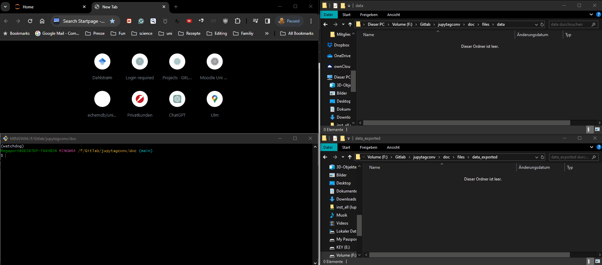

---
jupytext:
  formats: md:myst
  text_representation:
    extension: .md
    format_name: myst
    format_version: 0.13
    jupytext_version: 1.11.5
kernelspec:
  display_name: Python 3
  language: python
  name: python3
---
# Metadata

Each measurement file should be annotated by metadata, including data descriptors (units, description of the measured parameter), the experimental conditions (samples, instruments, environment parameters, ...), and possibly also non-specific metadata (users, project, ...).
Usually, only a limited number of descriptors will change between measurements.
For example, you could perform a series of measurements at different temperatures.
Hence we suggest storing all information in a template, preferably in YAML.
The YAML format has the advantage of being human and machine-readable alike.
A detailed description of how to write YAML can be found [elsewhere](https://www.cloudbees.com/blog/yaml-tutorial-everything-you-need-get-started#dictionaries).

A {download}`simple example <../files/data/data.csv.meta.yaml>` could look as follows:
```{code-cell} ipython3
:tags: [remove-input]
from IPython.display import Code

Code(filename='../files/data/data.csv.meta.yaml', language='yaml')
```

## Designing a metadata template

For further processing of your data, it is helpful to acquire as many details on the measurement as possible in a structured way.
The following categories are used by the [echemdb metadata-schema](https://github.com/echemdb/metadata-schema) and serve as examples to create your schema.

**curation**: Details on the persons involved in the data acquisition process.

```{note}
The name curation refers to the curation process of the measured data. The list can be extended later, when data is modified, reused or curated by other people.
```

```{note}
In principle, a list of ORCIDs would be sufficient. From that unique identifier, any other information on the users can be retrieved.
```

```{code-cell} ipython3
:tags: [remove-input]
from IPython.display import Code

Code(filename='../files/yaml_templates/curation.yaml', language='yaml')
```

**projects**: List of projects related to the source data, which can be a large third-party funded project, simply a PhD thesis or a small project within a PhD thesis.

```{code-cell} ipython3
:tags: [remove-input]
from IPython.display import Code

Code(filename='../files/yaml_templates/projects.yaml', language='yaml')
```

**figure description**: Contains descriptors for the underlying data, which are useful for exporting the data. It also contains information on what would be displayed in the figure and which other data is associated with the present figure/data.

```{note}
To create `unitpackages`, the structure for the fields must be followed. The `name` for each field must match a field/column name in the CSV (datafile).
```

```{code-cell} ipython3
:tags: [remove-input]
from IPython.display import Code

Code(filename='../files/yaml_templates/figure_description.yaml', language='yaml')
```

**experimental**: Details on the equipment and experimental procedures applied to the system that is described below.

```{code-cell} ipython3
:tags: [remove-input]
from IPython.display import Code

Code(filename='../files/yaml_templates/experimental.yaml', language='yaml')
```

**system**: Details on the system on which the experiment is performed, including anything that is in contact with or any eternal parameters that can have an impact on the measurement. Consider putting a banana in a beaker to study how its color changes when the external parameters, such as the atmosphere, temperature and light intensity/source.
Also, include information that does not seem to be relevant at the time of the data acquisition.

```{note}
This part is presumably the most important one. With increasing amount of information, more correlations can be drawn and possible issues can be found.
It also allows elucidating possible variations in future measurements. For example, assume a new student uses a new beaker in a new study on the same system, but does not receive the same results. If the beaker would be the problem, but its properties (glass, thickness, supplier, an internal ID, ...) were not recorded properly, one could not so easily pin down the origin of the problem.
```

```{code-cell} ipython3
:tags: [remove-input]
from IPython.display import Code

Code(filename='../files/yaml_templates/system.yaml', language='yaml')
```

An extensive example of a more complete YAML template for an electrochemical system can be found [here](https://github.com/echemdb/metadata-schema/blob/main/examples/file_schemas/autotag.yaml).

A complete YSML would contain all of the above (and other custom) categories.

```{code-cell} ipython3
:tags: [remove-input]
from IPython.display import Code

Code(filename='../files/yaml_templates/measurement.yaml', language='yaml')
```


## Loading templates

The YAML files can be loaded as a Python dictionary.

```{code-cell} ipython3
import yaml

metadata = yaml.load('../data/files/data.csv.meta.yaml', Loader=yaml.SafeLoader)
```

## Annotating data automatically

When (measurement) files are created in the file system, preferably the content of the YAML template is directly associated with the measurement file.
This can be achieved by monitoring the file system for newly created files. Following we illustrate the approach by using the Python watchdog module.
Besides we also provide a solution with a graphical user interface.

### Watchdog

The following code observes the folder `/data` for newly created `.csv` files.
On file creation, the content from the YAML template is written in the same folder where the file is created.
The name will be identical to the newly created file and a `.meta.yaml` is appended to the existing filename.

```{note}
We decided to append both suffixes `meta` and `yaml` to the original suffix, to clearly illustrate that this file
contains metadata for the recorded CSV and that the content is YAML.
```

```python
from watchdog.observers import Observer
from watchdog.events import FileSystemEventHandler
from pathlib import Path
import yaml


def create_metadata(filename):
    # load the metadata from a yaml template
    with open(yaml_template, 'rb') as f:
        metadata = yaml.load(f, Loader=yaml.SafeLoader)

    # Add further methods that enhance or modifiy the YAML template

    # write an output YAML file
    outyaml = Path(filename).with_suffix('.csv.meta.yaml')
    with open(outyaml, 'w') as f:
        yaml.dump(metadata, f)


class NewFileHandler(FileSystemEventHandler):
    def on_created(self, event):
        if Path(event.src_path).suffix == '.csv':
            # print the filename
            print(event.src_path, ' ' , Path(event.src_path).suffix)
            # When a new file is created we catch the filename and parse it to a method
            # that generates output yaml files and markdown files for additional notes
            create_metadata(event.src_path)

# create an observer
observer = Observer()

# schedule the observer to observe the folder
observer.schedule(NewFileHandler(), folder_path='./data/', recursive=False)

# start the observer
observer.start()
```

To stop watching the folder execute

```python
observer.stop()
```

### GUI

We are experimenting with different approaches to create applications that annotate data automatically.

* **[autotag-metadata](https://echemdb.github.io/autotag-metadata/)**: A standalone application, based on [Qt for Python](https://doc.qt.io/qtforpython-6/). It includes an editor for modifying YAML templates. This approach is preferable for end-users, for example, in the laboratory.
* **[autoquetado-voila](https://echemdb.github.io/autoquetado_voila/)**: Based on [ipywidgets](https://ipywidgets.readthedocs.io/en/latest/index.html), which can be served, for example, via [voila](https://voila.readthedocs.io/en/stable/). It can be included in Jupyter notebooks and due to its modular structure can be adapted more simply to specific needs. (Early development stage)


